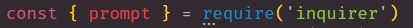
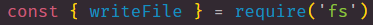
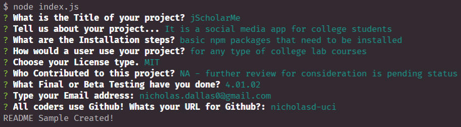
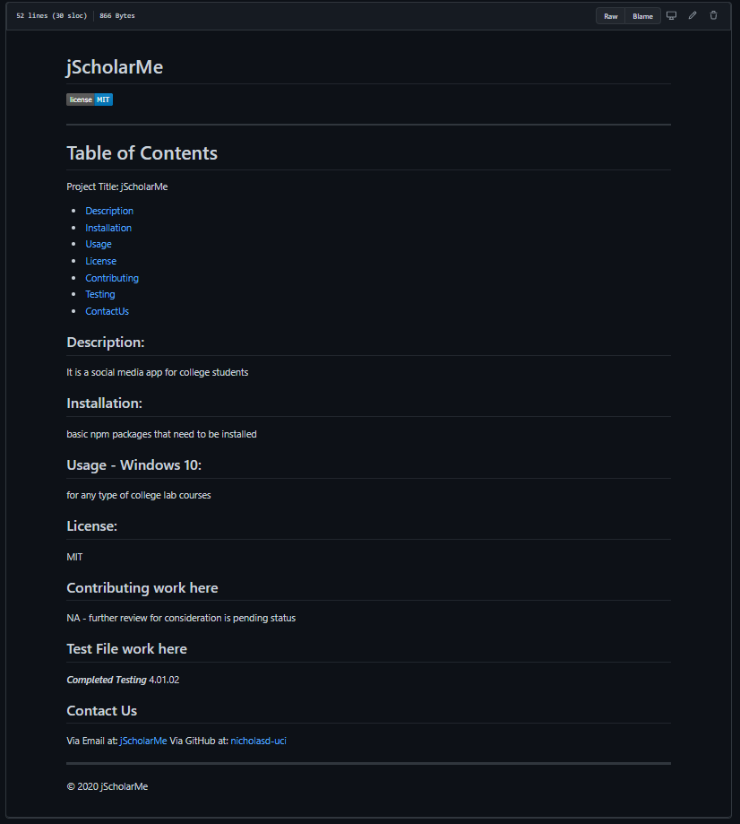

# goodReadMeGenerator

## About
```
Every developer needs a good README.md file. 
In this repository, we learn how to generate a README file. 
It then generator's users' information into a neatly placed README file. 
Consisting of title, description, installation, usage, license, contributing, testing, email, and Github.
```

## Prompting the user

*** Please be aware to check index.js for further understanding ***

> We first need to bring in prompt with inquirer 



> We also need to bring in fs.writeFile



> We use the "prompt" method in order to render questions to the user




# Final Results

> Once you have ran all the question and the file is generated it should look like this!




## LINKS

- [goodReadMeGenerator Deployed](https://nicholasd-uci.github.io/goodReadMeGenerator/)
- [GitHub Repo Link](https://github.com/nicholasd-uci/goodReadMeGenerator)
- [Nicholas Dallas's GitHub](https://github.com/nicholasd-uci)

- - -
© 2020 NPRD, Nicholas Paul Ruiz Dallas